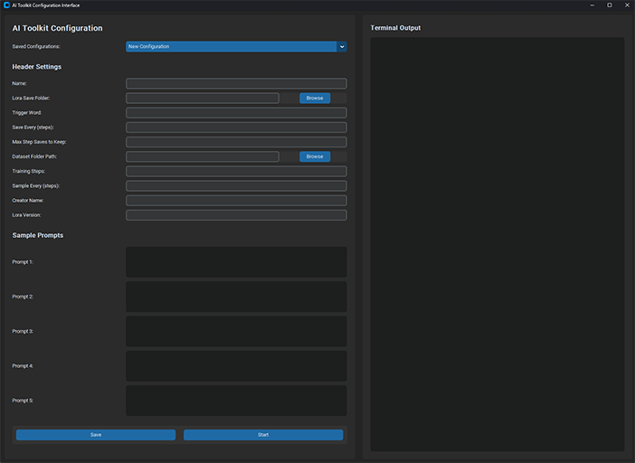

# Custom AI Toolkit UI

A modern, user-friendly interface for creating and managing YAML configuration files for AI Toolkit training sessions.

## Features

- Create and edit YAML configuration files with an intuitive UI
- Load and save configurations directly to the config folder
- Execute training sessions with real-time terminal output
- Modern CustomTkinter interface that adapts to system theme

## Installation

1. Place all files in your AI Toolkit root directory
2. Run `install.bat` to set up required dependencies in your existing virtual environment
   - The installer will automatically create the `start_ui.bat` file for you
3. Start the application with `start_ui.bat`

## Requirements

- AI Toolkit with virtual environment at `venv/`
- CustomTkinter and PyYAML (installed automatically by the installer)

## Usage

1. Fill in the configuration fields on the left panel
2. Save your configuration using the "Save" button
3. Use the "Start" button to begin training with your configuration
4. Monitor training progress in the terminal output panel

## Configuration Options

The interface supports all the key configuration options:

- Basic settings (name, trigger words)
- Lora save options
- Dataset paths
- Training parameters
- Sample prompts for training

Configurations are saved in YAML format compatible with AI Toolkit.

## License

MIT
